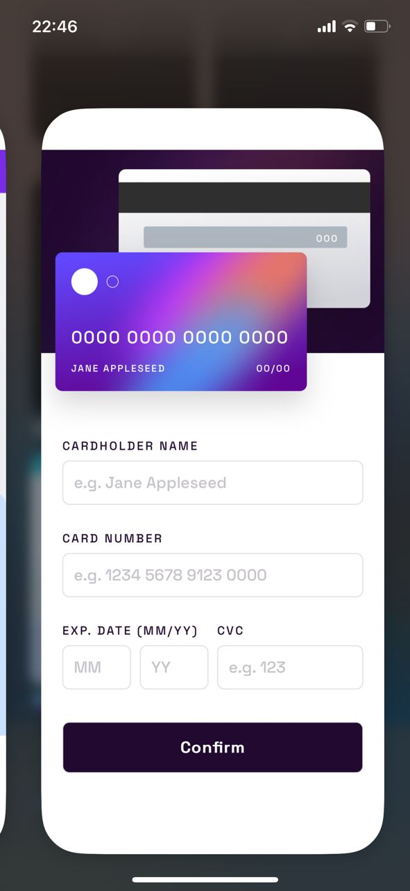
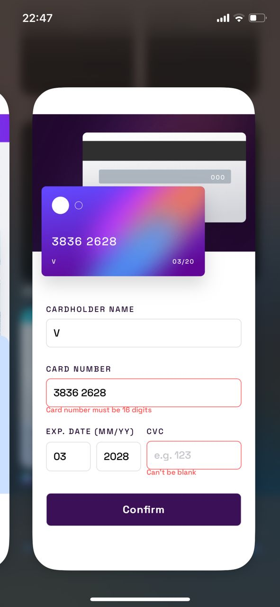
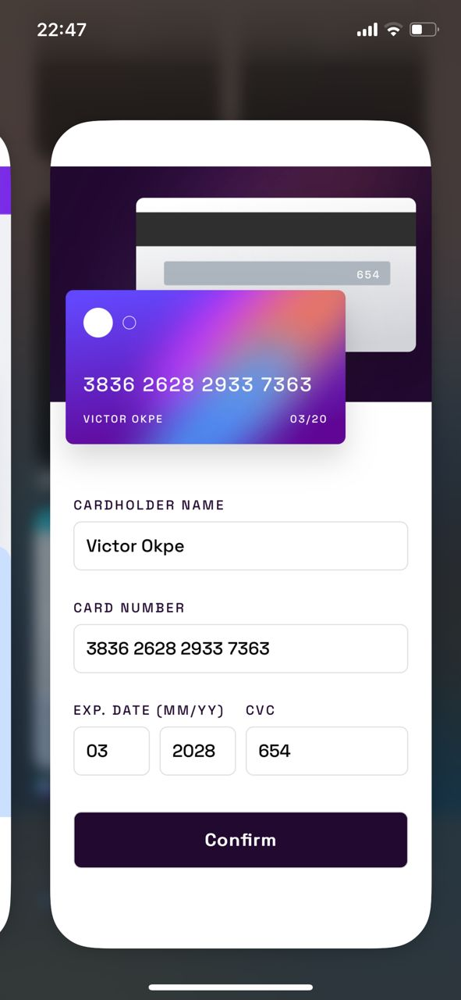
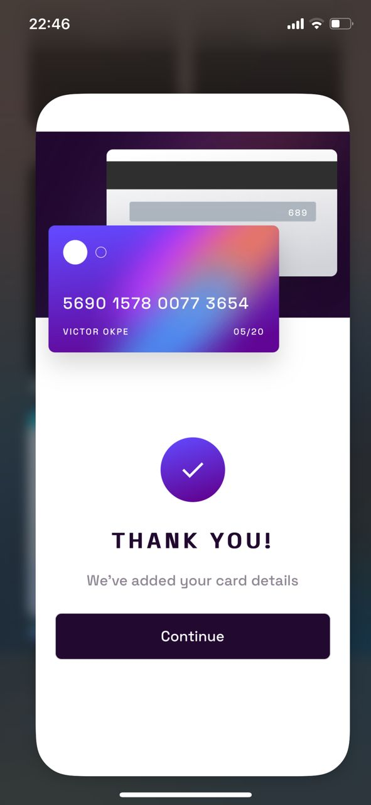

# Frontend Mentor - Interactive card details form solution

This is a solution to the [Interactive card details form challenge on Frontend Mentor](https://www.frontendmentor.io/challenges/interactive-card-details-form-XpS8cKZDWw). Frontend Mentor challenges help you improve your coding skills by building realistic projects.

## Table of contents

- [Overview](#overview)
  - [The challenge](#the-challenge)
  - [Screenshot](#screenshot)
  - [Links](#links)
- [My process](#my-process)
  - [Built with](#built-with)
  - [What I learned](#what-i-learned)
  - [Continued development](#continued-development)
- [Author](#author)
- [Acknowledgments](#acknowledgments)

## Overview

### The challenge

Users should be able to:

- Fill in the form and see the card details update in real-time
- Receive error messages when the form is submitted if:
  - Any input field is empty
  - The card number, expiry date, or CVC fields are in the wrong format
- View the optimal layout for the interface depending on their device's screen size
- See hover, active, and focus states for all interactive elements on the page

### Screenshot

### Screenshot

**Desktop View**


<br>

<details>
  <summary><strong>Click to expand: Mobile & Active States</strong></summary>
  <br>
  <table>
    <tr>
      <td></td>
      <td></td>
    </tr>
    <tr>
      <td></td>
      <td></td>
    </tr>
  </table>
</details>

### Links

- **Solution URL:** [Git-Repo](https://github.com/Victorbjay/my-interactive-card)
- **Live Site URL:** [my-interactive-card](https://my-interactive-card-two.vercel.app/)

## My process

### Built with

- Semantic HTML5 markup
- CSS custom properties for theming
- Flexbox for component alignment
- CSS Grid for the main page layout
- Mobile-first workflow
- Vanilla JavaScript for all interactivity

### What I learned

This project was a fantastic exercise in connecting a UI with client-side logic. The most significant learning was building a robust, custom validation system from scratch without relying on any libraries.

A key technique was dynamically adding and removing CSS classes to display error states. This keeps the styling concerns in the CSS file, while JavaScript handles the logic.

```js
// Helper function to show an error
function showError(inputElement, message) {
  // Add the error class to the input for styling
  inputElement.classList.add("input-error");

  // Find the associated paragraph for the error message
  const errorEl = document.getElementById(inputElement.id + "-error");
  if (errorEl) {
    errorEl.textContent = message;
  }
}
```

I'm also proud of the live card number formatting. Using a regular expression within the 'input' event listener to automatically add spaces creates a much better user experience.

```js
// Live formatting for the card number input
cardNumberInput.addEventListener("input", (e) => {
  // Remove non-digits, then use a regex to add a space after every 4 digits
  let formattedNumber = e.target.value.replace(/\D/g, "");
  formattedNumber = formattedNumber.replace(/(\d{4})/g, "$1 ").trim();

  // Update both the input field and the card display simultaneously
  e.target.value = formattedNumber;
  cardNumber.textContent = formattedNumber || "0000 0000 0000 0000";
});
```

### Continued development

This project solidified my understanding of core DOM manipulation. For future projects, I want to focus on two main areas:

1.  **Accessibility:** While I used semantic HTML, I want to delve deeper into ARIA (Accessible Rich Internet Applications) attributes to make complex interactive components like this even more accessible to screen reader users.
2.  **Component-Based Architecture:** I would like to rebuild this project using a JavaScript library like React. This would involve breaking down the UI into reusable components (`<CardFront>`, `<CardBack>`, `<CardForm>`) and managing the form's state, which would be an excellent next step.

## Author

- **Website** - [Victor-Okpe](https://github.com/Victorbjay)

- **Twitter** - [@victorbjay](https://www.twitter.com/victorbjay)

## Acknowledgments

This project was completed as a collaborative effort with Google's Gemini assistant, using all I was taught at Altschool Africa to sharpen my frontend skills. The process involved a detailed, iterative approach to ensure the layout and functionality precisely matched the design brief.
